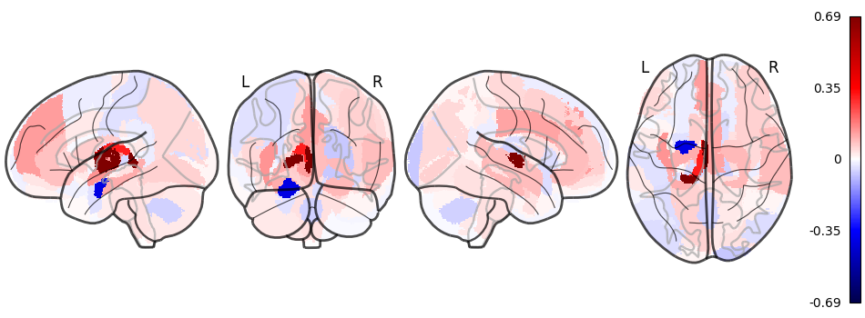
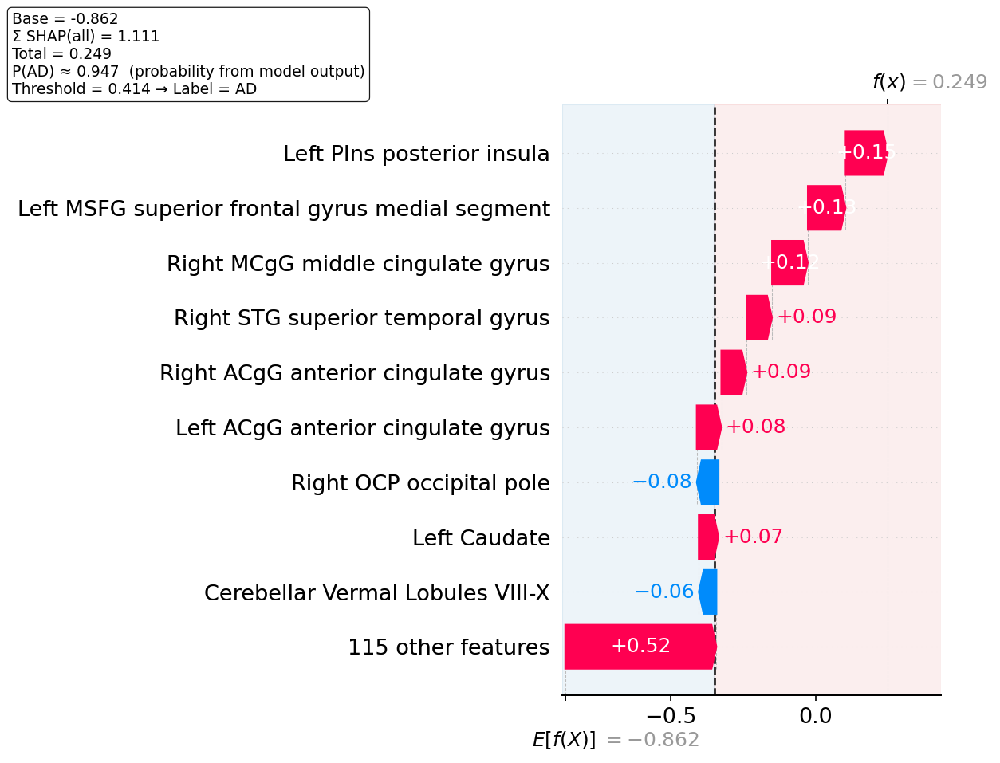

# Project README

Minimal, functional docs for the **current** scripts.

---

## 1) Setup (venv + requirements)

```bash
python3.12 -m venv .venv
# macOS/Linux
source .venv/bin/activate
python -V # should print 3.12.x

python -m pip install -U pip setuptools wheel
pip install -r requirements.txt
pip check
```

> Make sure you run the scripts from an activated virtual environment.

---

## 2) Input CSV (per‑region rows for one individual)

An example file is provided at **`data/seg_example.csv`**. Each row is **one brain region** for the **same subject**.

Required columns:

* `name` — region name (string)
* `index` — region index / id (int)
* `GMvalues_unthresholded` — numeric value per region (float)
* `GMvalues_thresholded` — numeric value per region (float)

`run_classification.py` will select the appropriate GM column based on `--GM_thrs`.

---

## 3) Script: `run_classification.py`

Loads a **pretrained model family** and produces a prediction for the provided subject‑level per‑region CSV.

### Arguments (current)

```python
parser.add_argument(
    "--input_csv",
    required=True,
    type=str,
    help="Path to subject per-region CSV"
)
parser.add_argument(
    "--output_folder",
    required=False,
    type=str,
    default="output_pred",
    help="Directory to write outputs (created as output_pred if missing)"
)
parser.add_argument(
    "--model",
    required=True,
    choices=["lgbm", "extratrees"],
    help="Model family to load"
)
parser.add_argument(
    "--GM_thrs",
    required=True,
    type=str2bool,
    help="Use thresholded GM values (True/False)"
)
parser.add_argument(
    "--thrs_target",
    required=True,
    choices=["youden", "sensitivity", "f1"],
    help="Which precomputed classification threshold to use."
)
```

### Example (pick one combination)

```bash
python run_classification.py \
  --input_csv data/seg_example.csv \
  --model lgbm \
  --GM_thrs True \
  --thrs_target youden \
  --output_folder output_pred
```

### Output

Writes prediction artifacts into `--output_folder` (default `output_pred`).

---

## 4) Script: `make_shap_graphs.py`

Generates SHAP visualizations from the **prediction folder** produced by `run_classification.py` (and the same per‑region CSV schema).

### Arguments (current)

```python
parser.add_argument(
    "--pred_folder",
    required=False,
    default="output_pred",
    type=str,
    help="Path to prediction folder from run_classification script"
)
parser.add_argument(
    "--output_folder",
    required=False,
    type=str,
    default="output_pred",
    help="Directory to write outputs (created as output_pred if missing)"
)
parser.add_argument(
    "--top_k",
    required=False,
    type=int,
    default=10,
    help="How many features to show in the waterfall plot (by |SHAP|)."
)
```

### Outputs

Saved to `--output_folder`:

* `shap_glass_brain.png` — Nilearn **glass‑brain** visualization colored by SHAP values.
* `shape_waterfall.png` — SHAP **waterfall** plot (top‑K features by |SHAP|).

---

## 5) Typical workflow

1. Prepare your per‑region CSV (or use `data/seg_example.csv`).

2. Run classification (example):

```bash
python run_classification.py \
  --input_csv data/seg_example.csv \
  --model lgbm \
  --output_folder output_pred
```

3. Generate SHAP figures:

```bash
python make_shap_graphs.py \
  --pred_folder output_pred \
  --output_folder output_pred \
  --top_k 10
```



---

## 6) Notes

* `--GM_thrs True` uses `GMvalues_thresholded`; `False` uses `GMvalues_unthresholded`.
* Keep the CSV schema exactly as shown; scripts expect these column names.
* `--pred_folder` should point to the folder produced by `run_classification.py`.
